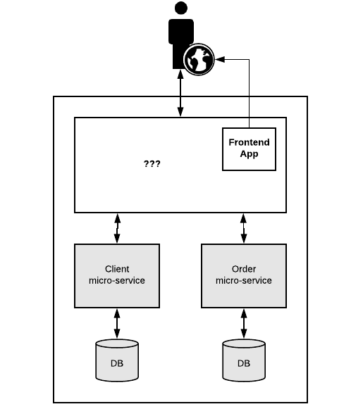
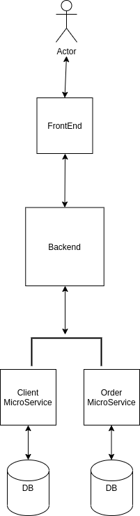

## iFood Challenge <a name = "about"></a>
The objective was development a solution to solve problem (diagram below) between frontend and microservice. I decided to develop a backend for conversation between frontend and microservice and implemented some concepts by DDD (Domain Drive Design) adapting the problem.

In **Backend** i separeted in Modules and when necessary joined Clients and Orders for a better return. 

In **Frontend** i used concepts like Mobile First and separeted into three components. 

* The first Component is Search Form with all inputs
* The second component is Input with all logic isolated like validation and specific styles and 
* The last component is Search Resul where is all logic of the result list and Modal with details by order. 

And finally, i change **Microservice** putting filter by Name, Email and Phone in only method, and created other methods necessary for better solution. More details in codes.

### Problem


### Resolution


## Getting Started <a name = "getting_started"></a>

These instructions will get you a copy of the project up and running on your local machine for development and testing purposes. See [deployment](#deployment) for notes on how to deploy the project on a live system. 

### Technology's
* [NodeJS](https://nodejs.org/en/)
* [Typescript](https://www.typescriptlang.org/)
* [React](https://pt-br.reactjs.org/)
* [Java](https://www.java.com/pt_BR/)
* [Spring](https://spring.io/)
* [Yarn](https://yarnpkg.com/) or [NPM](https://www.npmjs.com/)

### Prerequisites

What things you need to install and how to install them. Check if exists **Yarn**, **NPM**, **Java 8** and **Maven** in your machine for install dependencies and build the **microservice**, **backend** and **frontend**.

### Installing

A step by step series of examples that tell you how to get a development running. 
**Is more important follow this step by step. Make sure everything is working normally.**

### Microservices

To install and run the micro-services, use maven commands mvn package and mvn spring-boot:run on both folders. The Client will run on port 8081 and the Order on 8082.

```
mvn package
```

```
mvn spring-boot:run
```

### Backend

To install and run the backend, use yarn commands or npm commnds on folder. The server will run on port 3333.

Case you use NPM:

```
npm install
```

Case you use Yarn:

```
yarn
```

For build:

Case you use NPM:

```
npm run dev:server
```

Case you use Yarn:

```
yarn dev:server
```

### Frontend

To install and run the frontend, use yarn commands or npm commnds on folder. The Client will run on port 3000.

Case you use NPM:

```
npm install
```

Case you use Yarn:

```
yarn
```

For build:

Case you use NPM:

```
npm run start
```

Case you use Yarn:

```
yarn start
```